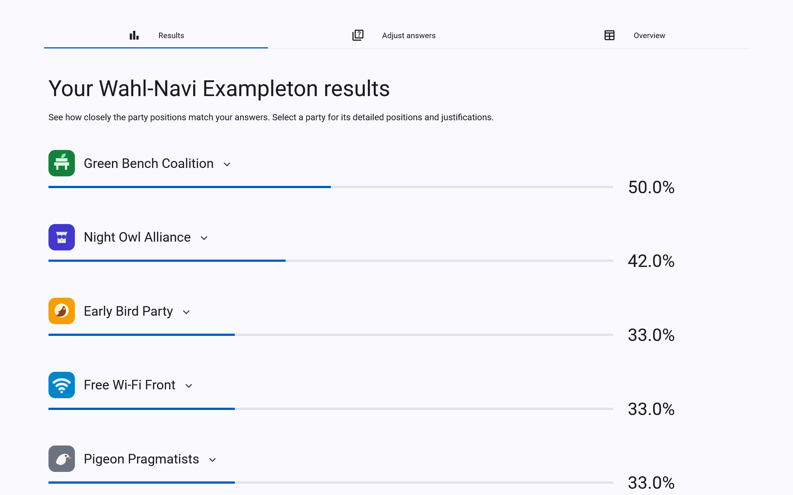
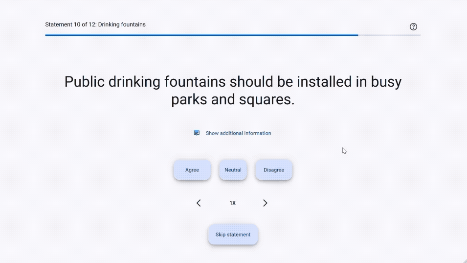
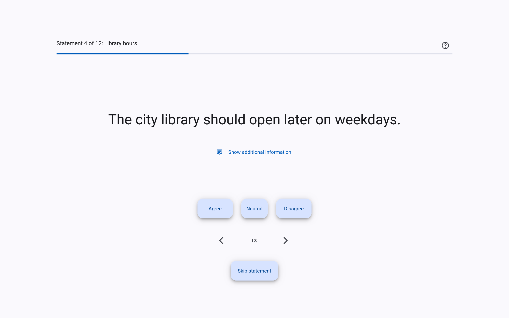
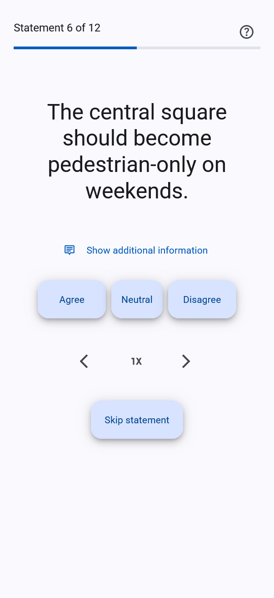
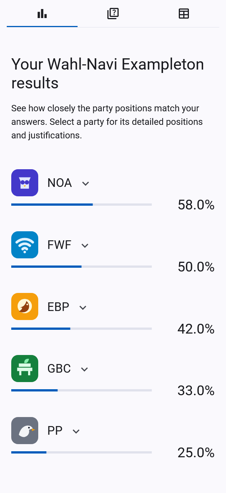
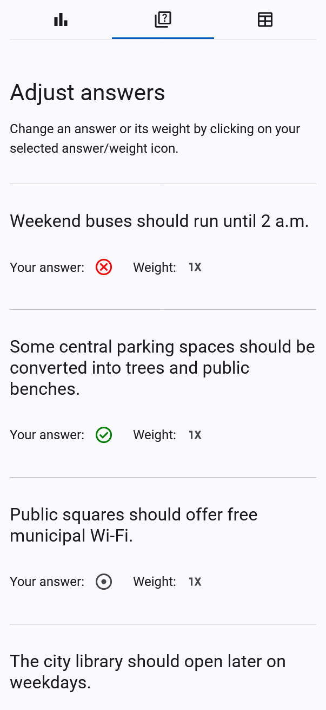
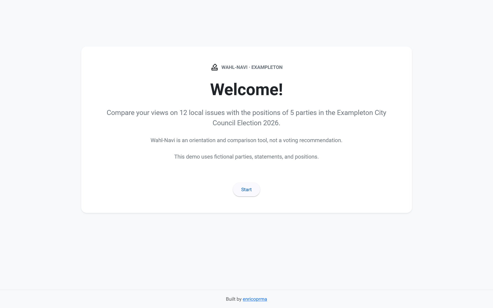
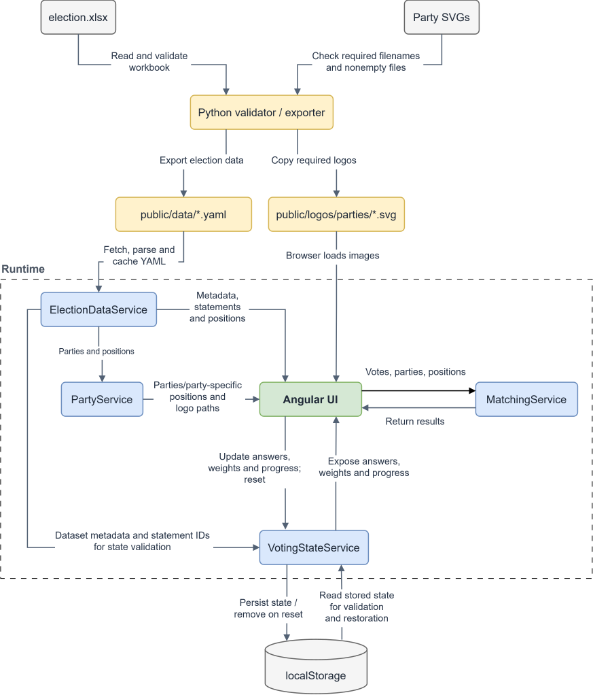

# Wahl-Navi

Wahl-Navi is an Angular election-orientation app that compares your answers with party positions. Originally developed for a real municipal election, this portfolio edition demonstrates the application with a fictional dataset and can be adapted using an Excel workbook and party logos.

> **Fictional demo:** All parties, statements, positions, justifications, logos, and election metadata in the bundled Exampleton dataset are made up. This edition does not provide voting advice.

<p>
  
</p>

[**Live Demo**](https://enricoprma.github.io/wahl-navi) · [Creating an election](docs/creating-an-election.md) · [Developer guide](docs/development.md)

## Contents

- [What it does](#what-it-does)
- [Production background and credits](#production-background-and-credits)
- [My contribution](#my-contribution)
- [Quick start](#quick-start)
- [Creating your own election](#creating-your-own-election)
- [Agreement calculation](#agreement-calculation)
- [Architecture](#architecture)
- [Quality checks](#quality-checks)
- [Scope](#scope)
- [License](#license)

## What it does

Users answer statements with **Agree**, **Neutral**, **Disagree**, or **Skip**, and can give selected statements double weight. Results rank parties by agreement and let users inspect the positions behind each score.

- Navigate back and forth and resume progress saved in the browser.
- Edit answers and weights from the results view.
- Read party justifications and compare all positions side by side.
- Use responsive layouts and keyboard-accessible controls.
- Configure election content through a validated Excel-to-YAML pipeline.

<p>
  
</p>

The restrained interface is intentional: parties share the same layouts, controls, and result styling. Party-specific colors are largely confined to identifying assets such as logos.

<p>
  
</p>

<p>
  
  &nbsp;
  
  &nbsp;
  
</p>

## Production background and credits

Wahl-Navi originated in the **2025 Bottrop municipal-election project**, a cooperation between **Zukunft Bottrop** and **Hochschule Ruhr West**. The application was also reused by **WAZ Essen** with a separate local dataset.

The wider project included an editorial process aimed at developing and reviewing politically neutral statements.

This portfolio edition replaces real election content and assets with Exampleton. The refactor also adds dataset configuration, stricter workbook and logo validation, safer persistence and result flows, and automated quality checks.

- [Original Bottrop deployment](https://www.zukunft-bottrop.de/wp-content/wahlnavi/)
- [Project background](https://www.zukunft-bottrop.de/wahl-navi/)
- [HRW report: technical credits and Essen reuse](https://www.hochschule-ruhr-west.de/news/news_2025/wahl-navi-bottrop-als-orientierungshilfe-fuer-die-kommunalwahl-gestartet)

The historical deployments used an earlier version and real election data. This repository is the later portfolio edition, not an archival copy of those deployments.

## My contribution

My work covered the end-to-end application implementation and the portfolio refactor. It included the Angular interface, questionnaire and matching logic, browser persistence, Excel-to-YAML data pipeline, tests, and build configuration.

## Quick start

Use **Node.js 22 with npm** and **Python 3.10 or newer**. CI uses Node 22 and Python 3.10.

From the repository root:

```bash
npm ci

# macOS / Linux
python3 -m pip install -r requirements-dev.txt

# Windows
py -3 -m pip install -r requirements-dev.txt

npm start
```

Open [localhost:4200](http://localhost:4200/). The fictional Exampleton dataset is already configured; `npm start` validates and exports it before starting Angular.

<p>
  
</p>

Use `python3` if that is your Python command, or `py -3` on Windows. Install dependencies into the interpreter selected by the npm helper: it tries `python3` first on macOS/Linux and `py -3` first on Windows, and prints the interpreter it uses.

## Creating your own election

Each build uses one dataset: an Excel workbook and one SVG logo per party. To adapt the app:

1. Copy `data/exampleton/` into a new dataset directory.
2. Replace the workbook content and logos.
3. Set the `workbook` and `logos` paths in `wahl-navi.config.json`.
4. Run `npm run data:check`, then `npm start` to preview.

The [election setup guide](docs/creating-an-election.md) covers the workbook schema, required fields, logo naming, dataset IDs, validation, and deployment.

For a production build:

```bash
npm run build
```

Deploy `dist/wahl-navi/browser/` to a static host. The build exports the configured dataset automatically. See the guide for [deployment under a subpath](docs/creating-an-election.md#8-create-a-production-build).

## Agreement calculation

For each party:

```text
agreement = round(100 × matching answer weights / all answered weights)
```

- Only identical positions match. Neutral matches neutral, with no partial credit against agree or disagree.
- An answer has weight 1, or weight 2 when double-weighted. Its weight counts in the denominator and, if it matches, the numerator.
- Skipped and unanswered statements are excluded. With all answers skipped, every party receives 0%.
- Results are rounded to whole percentages and sorted descending; ties retain workbook party order.

For example, a matching answer with weight 2 and a nonmatching answer with weight 1 produce `round(100 × 2 / 3) = 67%`.

## Architecture

The Python importer validates the configured workbook and logos, then generates YAML and copies party SVGs into `public/`. Angular loads these assets at runtime.

&nbsp;
<p>
  
</p>
&nbsp;

| Component             | Responsibility                                                                   |
| --------------------- | -------------------------------------------------------------------------------- |
| `ElectionDataService` | Load and cache the generated YAML.                                               |
| `PartyService`        | Provide party and position lookups by stable IDs and construct party logo paths. |
| `VotingStateService`  | Manage answers, weights, progress, and validated local persistence.              |
| `EvaluationComponent` | Gather data and pass votes, parties, and positions to the matching service.      |
| `MatchingService`     | Calculate agreement from supplied arrays independently of data loading.          |

Voting progress stays in the browser; no voting state is sent to a backend. The [developer guide](docs/development.md) explains persistence schemas, importer behavior, repository structure, and test coverage.

**Stack:** Angular 20, TypeScript, Angular Material, Bootstrap, Sass, and RxJS; Python with pandas, openpyxl, and PyYAML.

## Quality checks

```bash
npm run check
```

This runs importer tests, dataset validation, formatting checks, ESLint, headless Angular tests, and a production build. GitHub Actions runs the same core checks.

Tests require Google Chrome or a compatible Chromium executable. See the [browser setup instructions](docs/development.md#testing-and-ci) for `CHROME_BIN` and the [command reference](docs/development.md#npm-workflows) for individual checks.

## Scope

Wahl-Navi supports one election dataset per build, local browser persistence, and static hosting with hash routing. It has no backend, accounts, cloud persistence, runtime election switching, graphical election builder, or service worker/PWA runtime.

## License

Licensed under the [MIT License](LICENSE).
